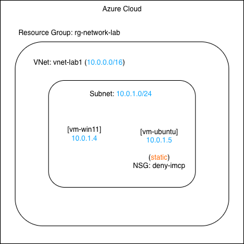
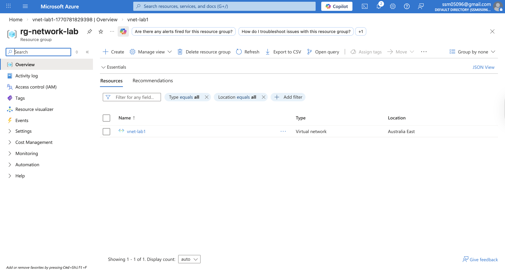
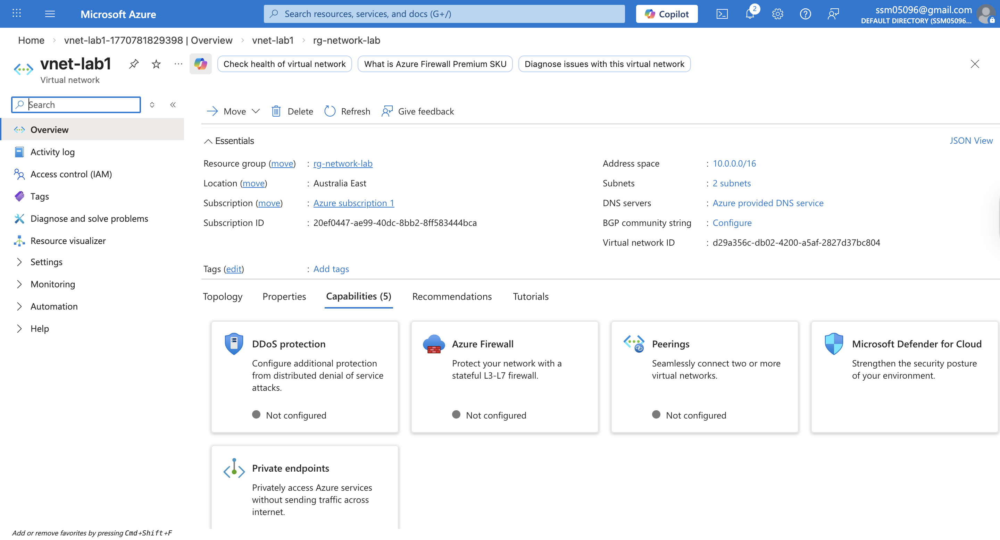
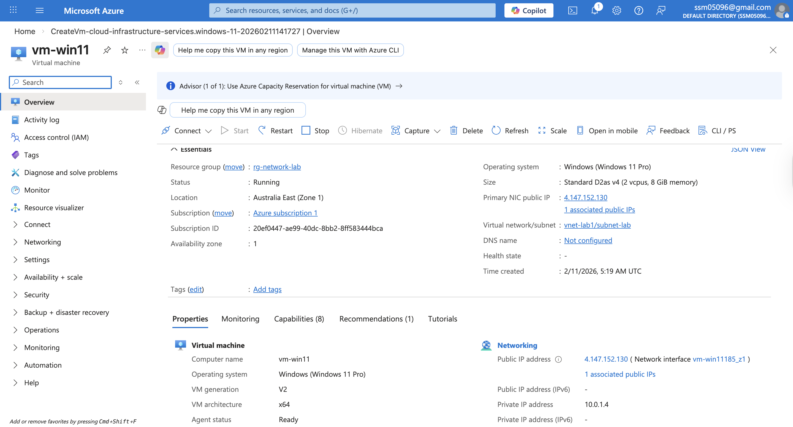
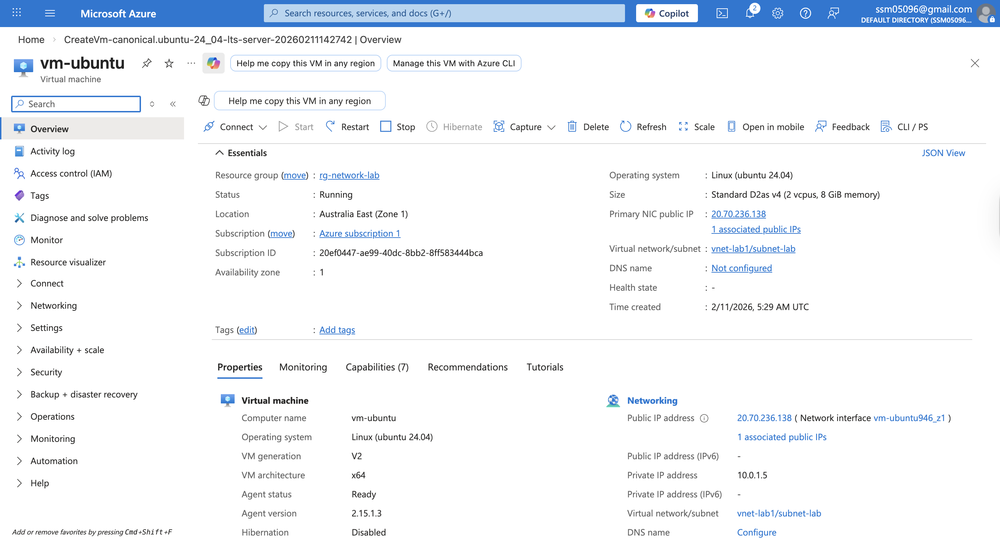
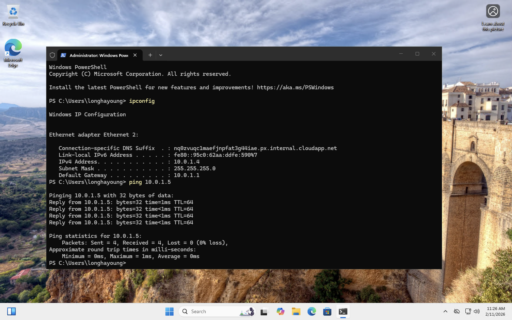
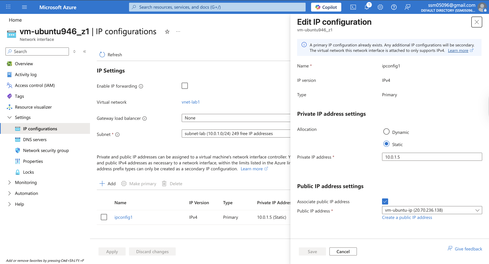
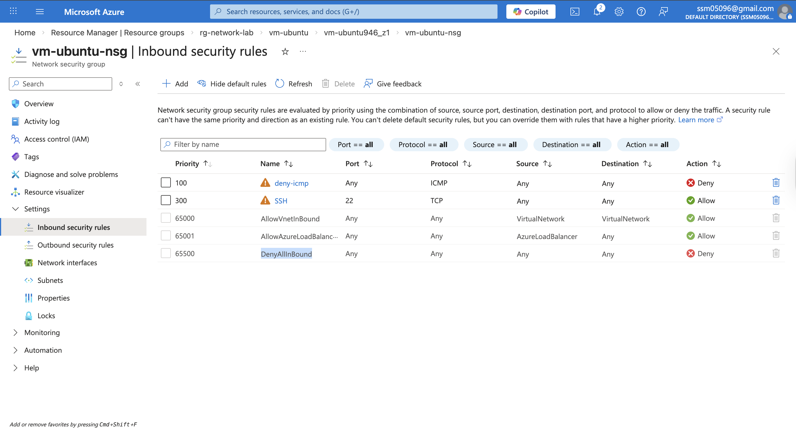

# Lab 1 – Azure Virtual Network & NSG Traffic Control

---

## Overview

In this lab, I built a basic network infrastructure in Microsoft Azure.

Two virtual machines were deployed:

- Windows 11 VM (Client)
- Ubuntu Server VM (Test Server)

Both VMs were placed in the same subnet to validate internal connectivity using ICMP (ping).

After confirming connectivity, I:

- Converted Ubuntu private IP from Dynamic to Static
- Created an NSG rule to block ICMP
- Verified traffic blocking and recovery

This lab demonstrates that network connectivity in Azure is controlled by security policy, not just VM status.

---

## Architecture

---

## Environment Details

- Resource Group: `rg-network-lab`
- Region: Australia East
- Virtual Network: `vnet-lab1`
- Address Space: `10.0.0.0/16`
- Subnet: `subnet-lab (10.0.1.0/24)`

### Virtual Machines

**vm-win11**
- Private IP: 10.0.1.4
- RDP enabled

**vm-ubuntu**
- Private IP: 10.0.1.5 (Static)
- SSH enabled
- Attached NSG with custom ICMP deny rule

---

## Step 1 – Resource Group Verification

Confirmed the resource group used for this lab.

---

## Step 2 – Virtual Network & Subnet Configuration

Verified VNet and subnet configuration:

- Address space: 10.0.0.0/16
- Subnet range: 10.0.1.0/24

---

## Step 3 – Windows VM Deployment

Windows 11 VM deployed inside the subnet.

---

## Step 4 – Ubuntu VM Deployment

Ubuntu Server deployed in the same subnet.

---

## Step 5 – Connectivity Test (ICMP Success)

From Windows VM:
ping 10.0.1.5

Result: Successful replies.

This confirms:

- Both VMs are in the same subnet
- No blocking security rule exists
- Internal routing is functioning

---

## Step 6 – Convert Ubuntu Private IP to Static

Changed private IP allocation:

Dynamic → Static (10.0.1.5)

This ensures stable addressing for server roles.

---

## Step 7 – Apply NSG Rule to Block ICMP

Created inbound NSG rule:

- Name: deny-icmp
- Protocol: ICMP
- Action: Deny
- Priority: 100

---

## Step 8 – Verify Traffic Blocking

From Windows VM:
ping 10.0.1.5

This confirms that NSG successfully blocked ICMP traffic.

After removing the rule, connectivity was restored.

---

## Key Technical Concepts

### Virtual Network (VNet)
Acts like a virtual LAN in Azure.

### Subnet
Logical segmentation inside a VNet.

### Private IP vs Public IP
Private IP enables internal communication.  
Public IP allows external access.

### Dynamic vs Static IP
Dynamic IP may change after deallocation.  
Static IP ensures stable server configuration.

### Network Security Group (NSG)
Azure firewall mechanism that controls inbound and outbound traffic based on:

- Priority
- Protocol
- Source/Destination
- Allow or Deny action

A virtual machine can be running but unreachable due to network policy.

---

## Resume Summary

Built an Azure virtual network and deployed Windows and Ubuntu VMs in the same subnet; validated internal connectivity using ICMP, configured static private IP addressing, and enforced traffic control through NSG firewall rules.
