# Lab 2 – DHCP & DNS Server Implementation (Ubuntu Server + Windows 11)

## Overview

This lab documents the configuration of a small internal network using:

- Ubuntu Server (DHCP + DNS server)
- Windows 11 (Client)
- VMware Fusion (Host-only network)

The objective was to:

- Configure a static IP on Ubuntu
- Deploy an ISC DHCP server
- Replace VMware’s built-in DHCP service
- Install and configure BIND9 as a local DNS server
- Validate dynamic IP allocation and domain name resolution

Network range used:

192.168.104.0/24

Ubuntu Server (DHCP/DNS): 192.168.104.129  
Windows Client (DHCP): 192.168.104.150  

---

# 1. Initial Network State

Before switching to Host-only mode, Ubuntu received an IP from a different virtual network.

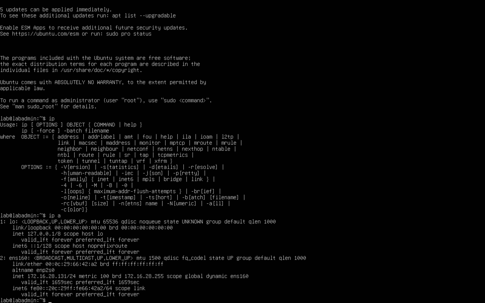

---

# 2. Host-only Network Configuration

After switching to VMware Host-only (VNET1), the IP address changed.

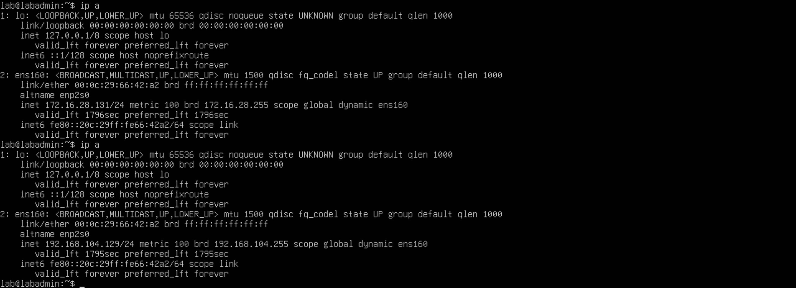

---

# 3. Configure Static IP (Netplan)

To ensure consistent DHCP and DNS service operation, Ubuntu was assigned a static IP.

`/etc/netplan/50-cloud-init.yaml`

```yaml
network:
  version: 2
  ethernets:
    ens160:
      dhcp4: false
      addresses:
        - 192.168.104.129/24
```

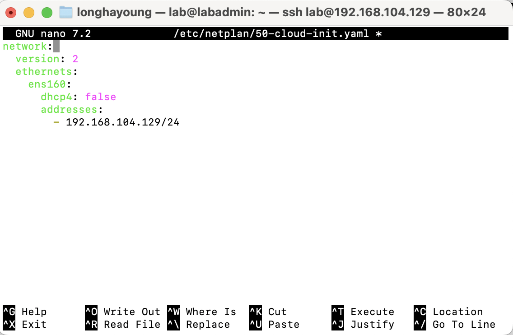

---

# 4. Apply Network Configuration

```bash
sudo netplan apply
```

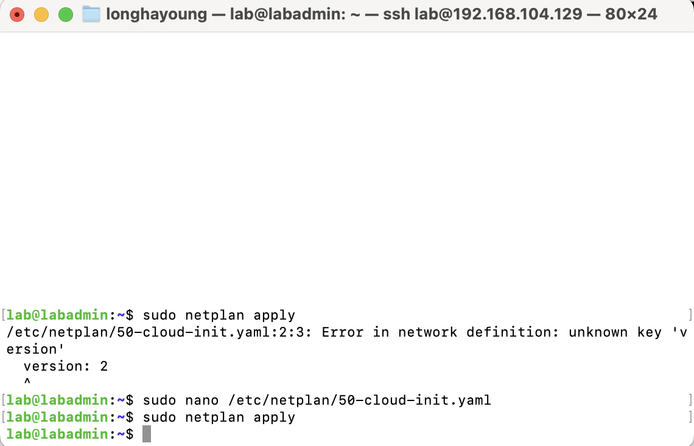

---

# 5. Install and Configure DHCP Server

Install:

```bash
sudo apt install isc-dhcp-server
```

Specify interface:

`/etc/default/isc-dhcp-server`

```
INTERFACESv4="ens160"
```

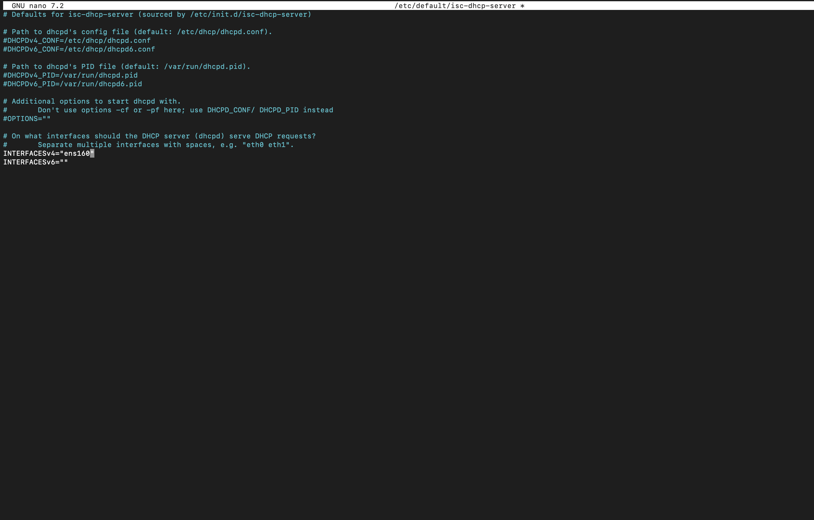

---

# 6. Configure DHCP Scope

`/etc/dhcp/dhcpd.conf`

```conf
subnet 192.168.104.0 netmask 255.255.255.0 {
    range 192.168.104.150 192.168.104.200;
    option routers 192.168.104.129;
    option domain-name-servers 192.168.104.129;
    default-lease-time 600;
    max-lease-time 7200;
}
```

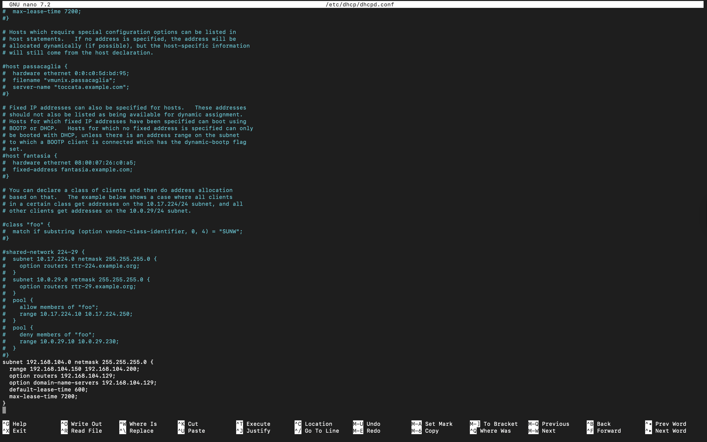

---

# 7. Verify DHCP Service

```bash
sudo systemctl restart isc-dhcp-server
sudo systemctl status isc-dhcp-server
```

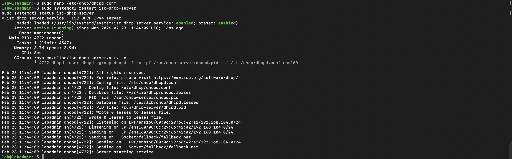

---

# 8. Windows Client – DHCP Mode Check

Confirmed that Windows network settings were set to automatic (DHCP).

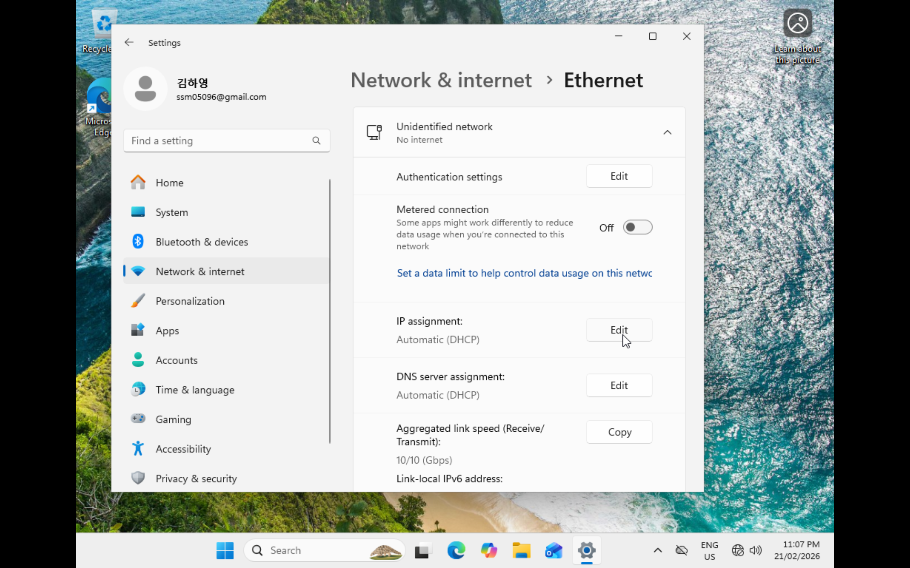

---

# 9. Original Windows IP (VMware DHCP)

Before disabling VMware DHCP, Windows received an IP from VNET1.

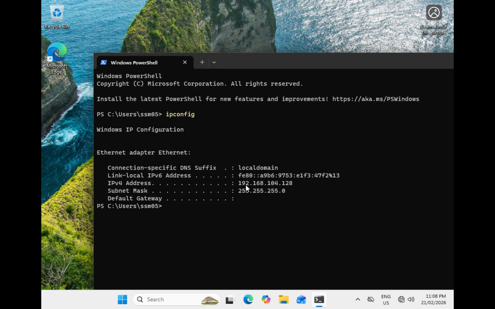

---

# 10. Disable VMware DHCP

VMware’s built-in DHCP service for VNET1 was disabled so Ubuntu becomes the only DHCP server.

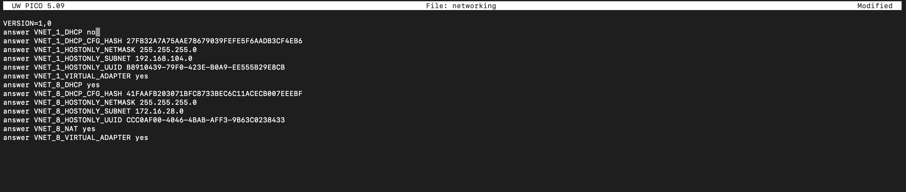

---

# 11. Windows Receives IP from Ubuntu DHCP

After:

```powershell
ipconfig /release
ipconfig /renew
```

Windows received:

- IP: 192.168.104.150
- Gateway: 192.168.104.129

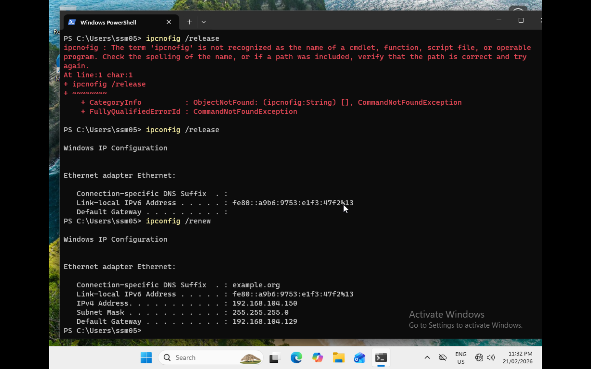

---

# 12. Verify DHCP Logs

```bash
sudo tail -f /var/log/syslog
```

Confirmed:

- DHCPDISCOVER
- DHCPOFFER
- DHCPREQUEST
- DHCPACK

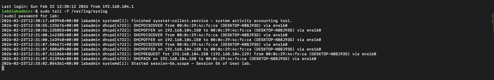

---

# 13. Verify Lease File

```bash
cat /var/lib/dhcp/dhcpd.leases
```

Lease entry confirmed for Windows client.

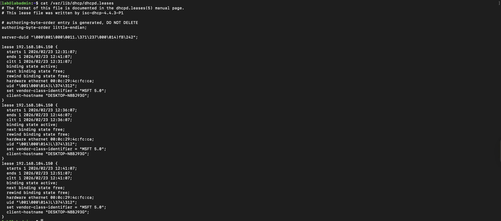

---

# 14. Install DNS Server (BIND9)

```bash
sudo apt install bind9 bind9-utils
```

Check status:

```bash
sudo systemctl status bind9
```

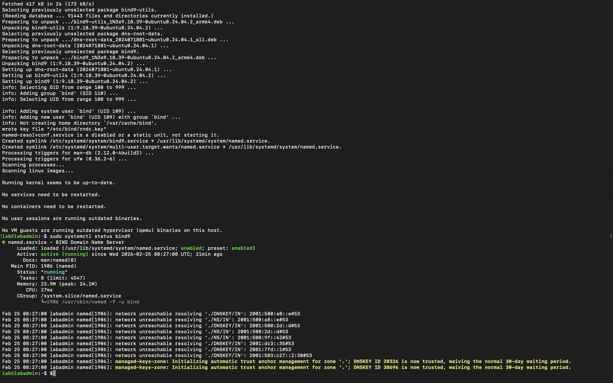

---

# 15. Configure DNS Zone

`/etc/bind/named.conf.local`

```conf
zone "lab.local" {
    type master;
    file "/etc/bind/db.lab.local";
};
```

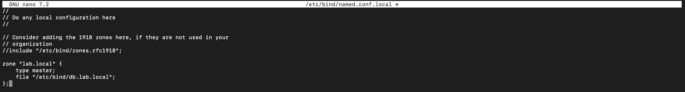

---

# 16. Create Zone File

`/etc/bind/db.lab.local`

```conf
@   IN  SOA lab.local. admin.lab.local. (
        2
        604800
        86400
        2419200
        604800 )

@       IN  NS      lab.local.
lab.local. IN  A     192.168.104.129
dns        IN  A     192.168.104.129
client     IN  A     192.168.104.150
```

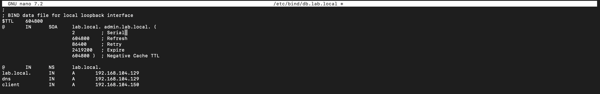

---

# 17. Validate and Restart DNS

```bash
sudo named-checkconf
sudo named-checkzone lab.local /etc/bind/db.lab.local
sudo systemctl restart bind9
```

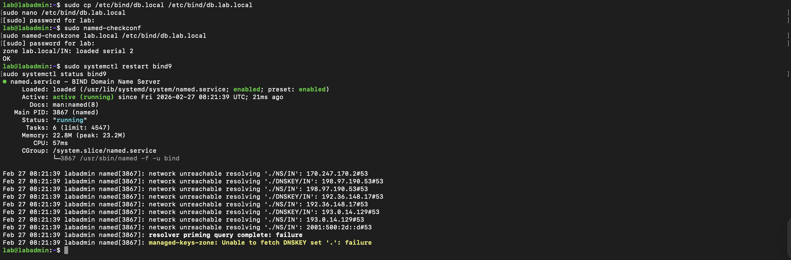

---

# 18. Add Domain Option to DHCP

Updated DHCP configuration to include domain name:

```conf
option domain-name "lab.local";
```

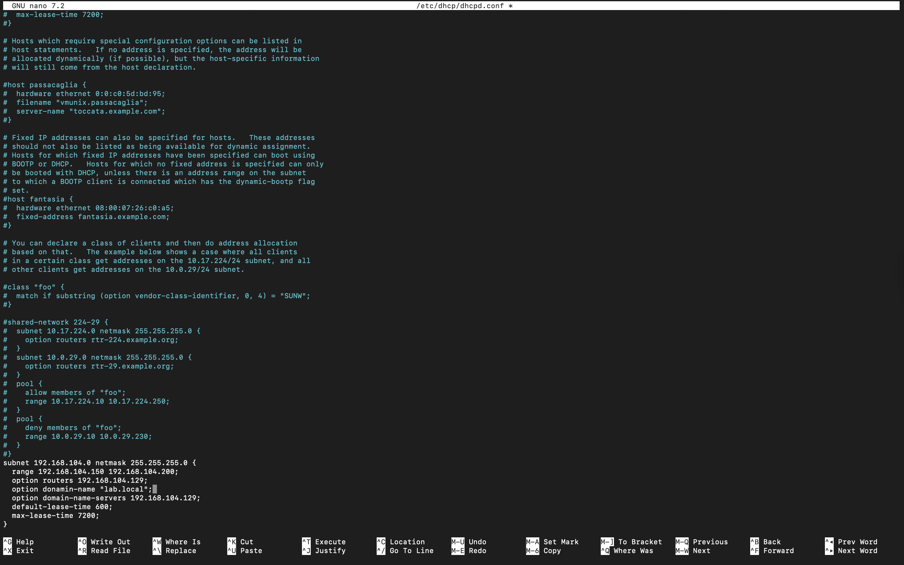

---

# 19. Confirm DNS Configuration on Windows

```powershell
ipconfig /all
```

Confirmed:

- DNS Server: 192.168.104.129
- DNS Suffix: lab.local

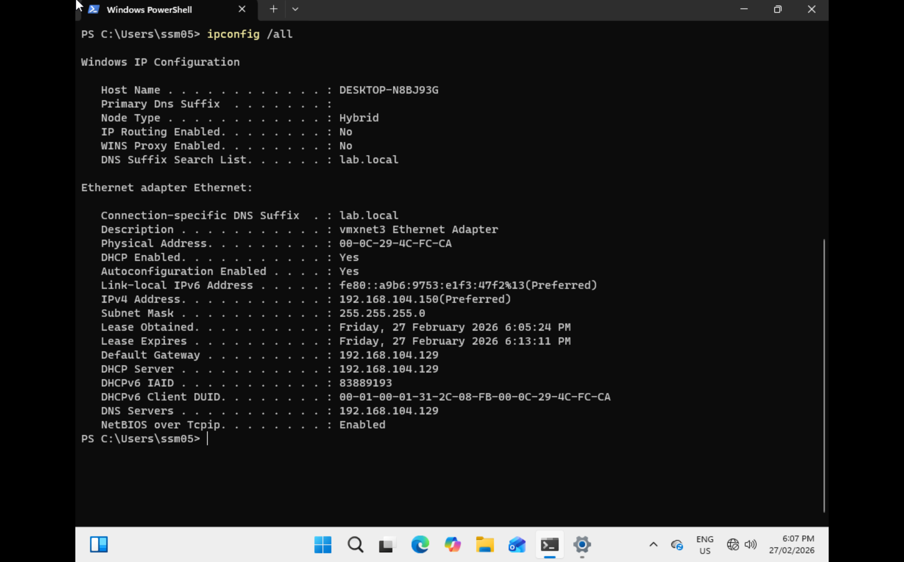

---

# 20. Test DNS Resolution

```powershell
nslookup dns.lab.local
nslookup client.lab.local
nslookup lab.local
```

All records resolved correctly.

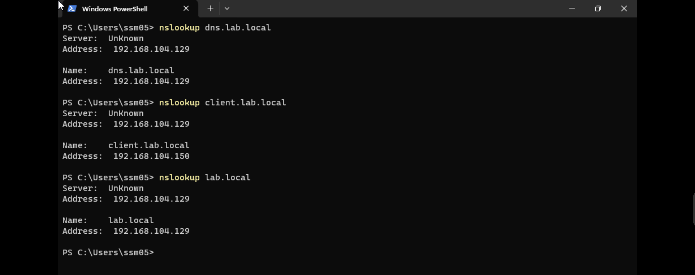

---

# Key Concepts Covered

- Static vs dynamic IP addressing
- DHCP scope and lease management
- Interface binding for DHCP service
- DNS zone configuration (BIND9)
- Forward lookup records
- Service management using systemctl
- Log-based troubleshooting
- Interaction between DHCP and DNS
- Virtual network design (Host-only)

---

# Conclusion

This lab demonstrates the setup of a controlled internal network environment where:

- Ubuntu functions as both DHCP and DNS server
- Windows client dynamically receives IP and DNS settings
- A custom domain (`lab.local`) resolves successfully
- VMware internal DHCP is fully replaced

The configuration was validated through service status checks, lease inspection, log monitoring, and DNS resolution testing.
