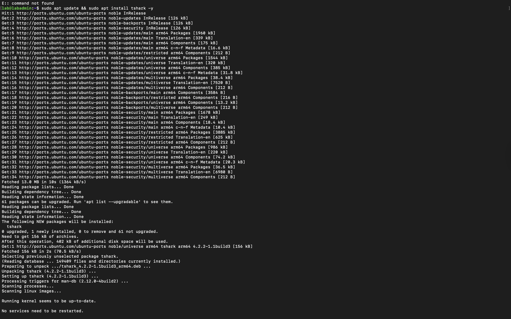
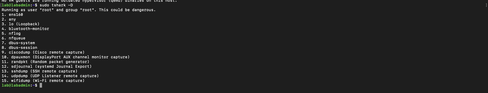
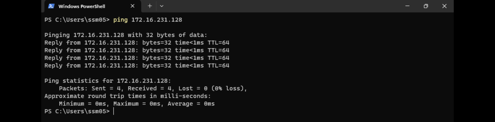
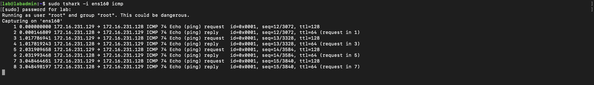
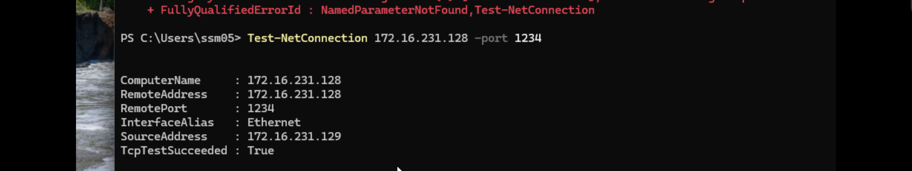
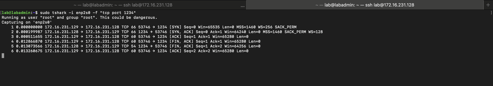
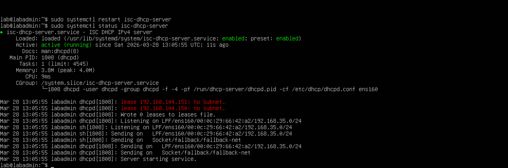
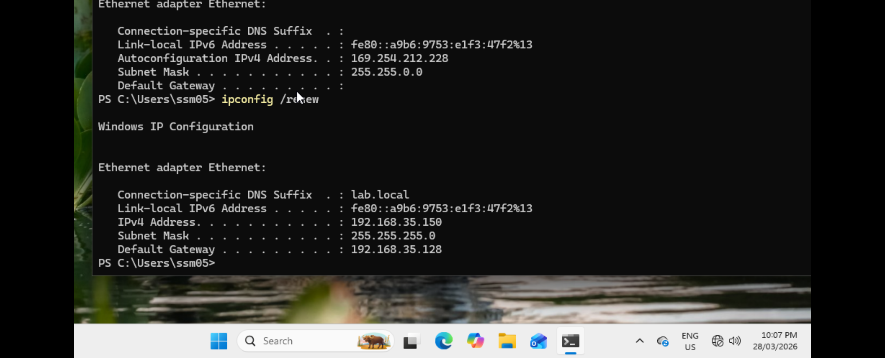
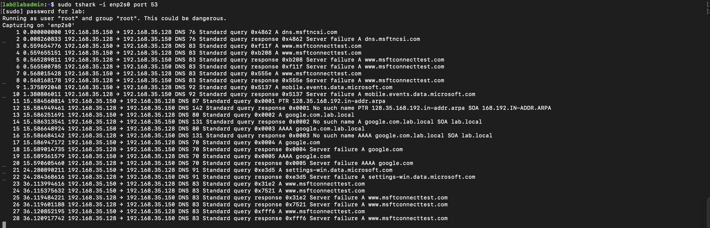
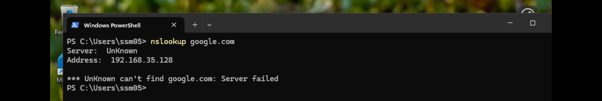

# Lab 3 — Packet Analysis (Tshark)

## Overview

In this lab, I analyzed network traffic at the packet level using Tshark.

Instead of only verifying connectivity (as in previous labs), this lab focuses on understanding what actually happens inside the network when communication occurs.

I captured and analyzed three fundamental types of network traffic:

- ICMP (Ping)
- DNS (Domain Name Resolution)
- TCP (Connection Establishment)

Through this lab, I observed how packets move between devices, how protocols interact, and how network communication can be inspected for troubleshooting and analysis.

This lab demonstrates that network activity is not abstract — it can be captured, filtered, and understood in detail.


## Objectives

- Capture live network traffic using Tshark
- Filter specific protocols (ICMP, DNS, TCP)
- Analyze packet structure and communication flow
- Understand how:
  - Ping works (ICMP)
  - DNS resolves domain names
  - TCP establishes connections (3-way handshake)
- Build visibility into network behavior for troubleshooting and security analysis


## Environment

- Ubuntu Server (Packet capture using Tshark)
- Windows Client (Traffic generation)
- Network: Host-only / Private VM network
- Tools: Tshark


## Key Concepts

- Packet vs Protocol
- Source and Destination IP
- ICMP (Echo Request / Reply)
- DNS Query / Response
- TCP 3-way Handshake (SYN, SYN-ACK, ACK)
- Network visibility and traffic analysis

## Step 1 — Install Tshark on Ubuntu Server

To capture and analyze network traffic from the server side, I installed **Tshark**, the command-line version of Wireshark.

Tshark is useful in server environments where a graphical interface is not available, and it allows efficient packet capture directly from the terminal.

### Command used

```bash
sudo apt update && sudo apt install tshark -y
```

### Result

Tshark was successfully installed on the Ubuntu server without errors.




## Step 2 — Identify Network Interface for Capture

Before capturing traffic, I needed to identify which network interface Tshark should listen on.

To list available interfaces, I used:

```bash
sudo tshark -D
```

### Result

The system returned multiple interfaces, including:

- `ens160` → primary network interface
- `lo` → loopback interface (local traffic only)
- `any` → captures from all interfaces




### Analysis

- `ens160` is the main network interface connected to the VM network
- `lo` (loopback) is only used for internal communication within the host
- `any` can capture all traffic, but may include unnecessary noise

### Decision

I selected **ens160** as the capture interface because:

- It represents actual network traffic between machines
- It is where ICMP, DNS, and TCP traffic will flow in this lab

### Key Insight

Choosing the correct interface is critical.

If the wrong interface is selected:
- no packets will be captured
- or only irrelevant traffic will appear

This step ensures accurate packet analysis in later stages.

## Step 3 — Capture ICMP Traffic (Ping)

To generate network traffic, I initiated a ping request from the Windows client to the Ubuntu server.

### Generate Traffic (Client)

```powershell
ping 172.16.231.128
```

This sends ICMP Echo Requests to the server to test connectivity.




---

### Capture Traffic (Server)

On the Ubuntu server, I used Tshark to capture ICMP traffic on the selected interface:

```bash
sudo tshark -i ens160 icmp
```




---

### Analysis

The captured output shows:

- ICMP Echo Request (from client → server)
- ICMP Echo Reply (from server → client)

Example flow:

```
Client → Server : Echo Request
Server → Client : Echo Reply
```

Each request is followed by a corresponding reply, confirming successful communication.

---

### Key Observations

- ICMP is used to verify network connectivity between hosts
- Packet capture confirms that communication is actually happening at the network level
- Source and destination IP addresses clearly show traffic direction
- TTL values differ:
  - Request (TTL=128 → Windows default)
  - Reply (TTL=64 → Linux default)

---

### Key Insight

Ping is not just a “connectivity test”.

It is a **real packet exchange** that can be captured and analyzed.

This demonstrates that:

- Network communication is observable
- Every action (like ping) generates actual packets
- Packet analysis can validate and troubleshoot connectivity issues

## Step 4 — Generate TCP Traffic

To analyze TCP communication, I generated traffic from the Windows client using PowerShell.

### Command used

```powershell
Test-NetConnection 172.16.231.128 -Port 1234
```

This command attempts to establish a TCP connection to the specified IP and port.




---

### Result

- `TcpTestSucceeded : True`
- Connection to port **1234** was successful

This confirms that:

- The target host is reachable
- The specified port is open
- TCP communication is allowed between client and server


## Step 5 — Capture TCP Handshake

After generating TCP traffic, I captured the packets on the Ubuntu server to analyze how the connection is established and terminated.

### Command used

```bash
sudo tshark -i ens160 -f "tcp port 1234"
```

This filter captures only TCP traffic on port 1234.




---

### Analysis — TCP 3-Way Handshake

The capture shows the full TCP connection process:

```
1. Client → Server : SYN
2. Server → Client : SYN-ACK
3. Client → Server : ACK
```

This is known as the **TCP 3-way handshake**, which establishes a reliable connection before any data transfer.

---

### Connection Termination (FIN)

After the connection is established, it is properly closed using:

```
Client → Server : FIN, ACK
Server → Client : FIN, ACK
Client → Server : ACK
```

This ensures that both sides agree to terminate the connection safely.

---

### Key Observations

- TCP uses ports to identify services (port 1234 in this case)
- Sequence (`Seq`) and Acknowledgement (`Ack`) numbers track communication state
- TCP is stateful — both sides maintain connection state
- Connection setup and teardown are clearly visible in packet capture

---

### Key Insight

Unlike ICMP, TCP:

- requires a structured handshake before communication
- guarantees reliable data delivery
- manages connection state throughout its lifecycle

This packet-level view shows exactly how real-world applications (e.g., HTTP, SSH) establish and close connections.

---

### Note

Initially, I attempted to use the wrong interface name (`enp2s0` instead of `ens160`), but traffic was still captured due to interface aliasing.

## Step 6 — Configure and Verify DHCP Server

In this step, I configured the Ubuntu server as a DHCP server and verified that the Windows client successfully received an IP address.

---

### Configuration Steps

1. Set a static IP on the Ubuntu server  
2. Changed network mode (Shared → Private Network)  
3. Applied Netplan configuration  
4. Configured DHCP subnet in `/etc/dhcp/dhcpd.conf`  
5. Set interface in `/etc/default/isc-dhcp-server`  
6. Restarted DHCP service  

```bash
sudo systemctl restart isc-dhcp-server
sudo systemctl status isc-dhcp-server
```




---

### DHCP Server Status

- Service is **active (running)**
- Listening on interface: `ens160`
- Subnet configured: `192.168.35.0/24`

Some initial warnings appeared (`no subnet`), but the service started successfully after proper configuration.

---

### Client Verification (Windows)

On the Windows client, I refreshed the network configuration:

```powershell
ipconfig /renew
```




---

### Result

The client received:

- IP Address: `192.168.35.150`
- Subnet Mask: `255.255.255.0`
- Default Gateway: `192.168.35.128`
- DNS Suffix: `lab.local`

---

### Key Observations

- DHCP dynamically assigns IP addresses to clients
- The client initially had a **169.254.x.x (APIPA)** address (no DHCP)
- After configuration, it received a valid IP from the server
- This confirms successful DHCP communication

---

## Step 7 — Capture DNS Traffic

To analyze DNS behavior, I generated DNS queries from the Windows client and captured them on the Ubuntu server.

---

### Generate DNS Query (Client)

```powershell
nslookup google.com
```




---

### Capture DNS Packets (Server)

```bash
sudo tshark -i ens160 port 53
```

This captures DNS traffic (UDP/TCP port 53).




---

### Analysis

The capture shows:

- DNS **query** from client → server
- DNS **response** from server → client

Example:

```
Client → Server : DNS Query (A record for google.com)
Server → Client : DNS Response (Server failure)
```

---

### Key Observations

- DNS uses **port 53**
- Queries include:
  - `A` (IPv4 lookup)
  - `AAAA` (IPv6 lookup)
  - `PTR` (reverse lookup)
- Multiple retries occur when resolution fails
- Response shows **"Server failure"**

---

### Result

- DNS requests are successfully sent to the server
- However, the server returns **failure responses**

This indicates:

- DNS service is reachable
- But not properly configured to resolve external domains

---

### Key Insight

DNS is not just a query system — it depends on:

- correct zone configuration
- forwarding settings
- external DNS resolution

Even though the network is working, **name resolution fails without proper DNS setup**.


